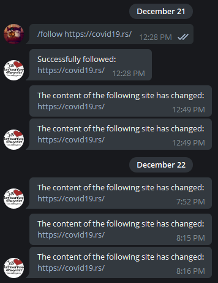

# Avro bot

<b>
Avro bot will notify you whenever a site changes its content! All you have to do is specify the sites you're interested in. 
Once you follow an url, the bot will store your chat id, url and current webpage content hashed. Every 60 seconds, bot is monitoring all of the urls in the database and checks if the hash has changed since the last monitor. If it did, it sends a message to the corresponding chat.
</b>

## :computer: About

<b>Written in:</b> Python3  
<b>Libraries used:</b> psycopg2, python-telegram-bot  
<b>Database:</b> PostgreSQL  
<b>Deployed on:</b> Heroku  
<b>Date:</b> December 2020

## :grey_exclamation: Warning

Bot is taken off server so it's down at the moment.

## ❔ How to use:

<b>Username:</b> @matf_bot

* <b>/start</b> - See the starting message
* <b>/follow <link(s)></b> - Url(s) that you'd like to keep track of
* <b>/unfollow <link(s)></b> - Url(s) that you no longer want to keep track of
* <b>/unfollow_all</b> - Delete all your urls from the database
* <b>/list</b> - Info on what you follow
* <b>/comment <comment></b> - Leave a comment for me!
* <b>/list_comments </b> - See all your comments
* <b>/end</b>- Wipe all your data 
* <b>/help</b> - Bot manual/list of commands

Any suggestions or questions, either contact the bot creator (me): @mincxh or send a comment via bot.  

